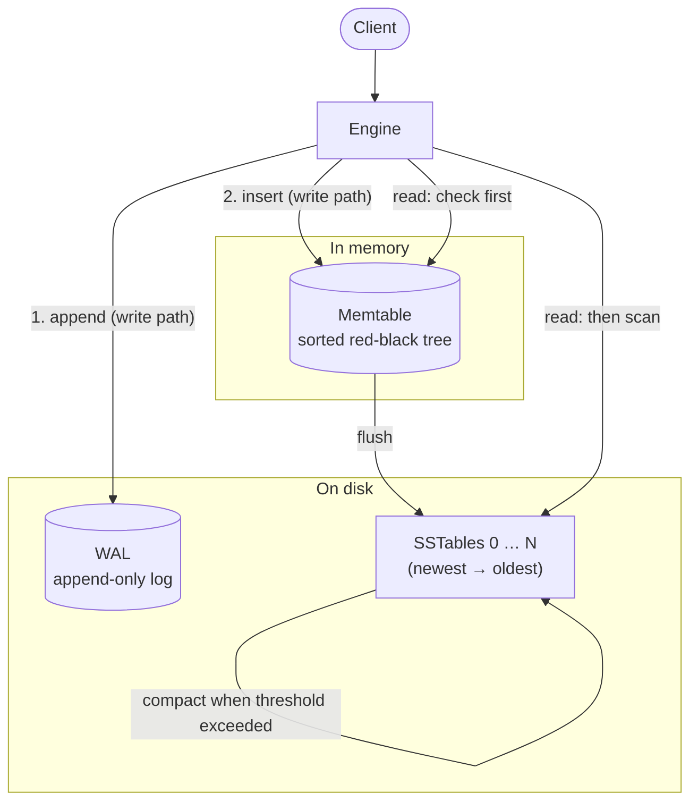
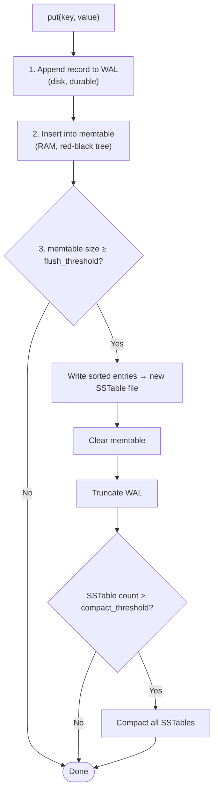
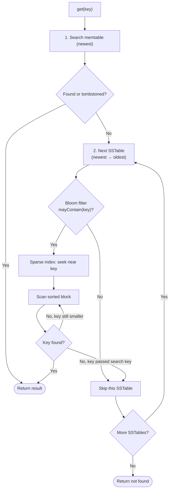
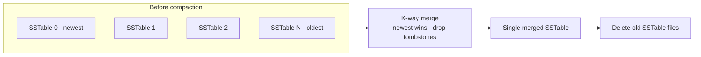
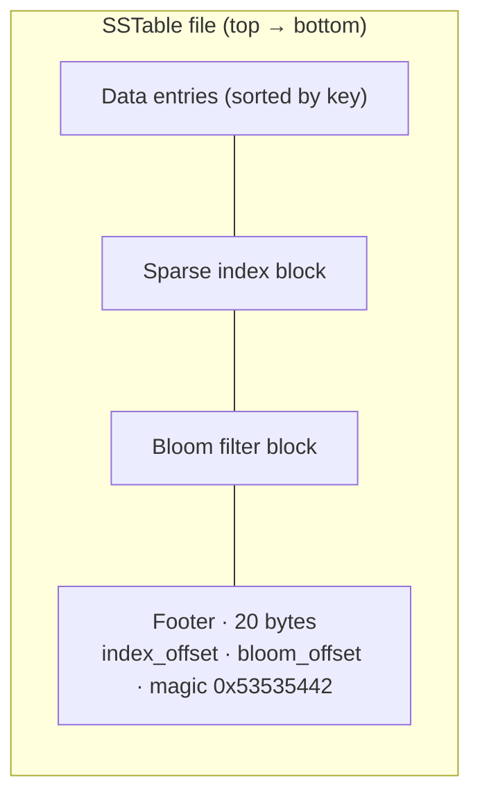
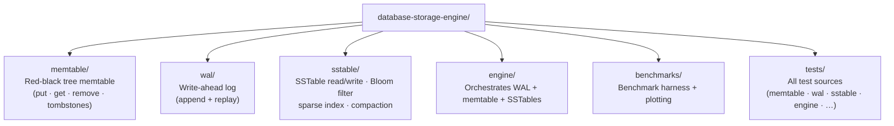
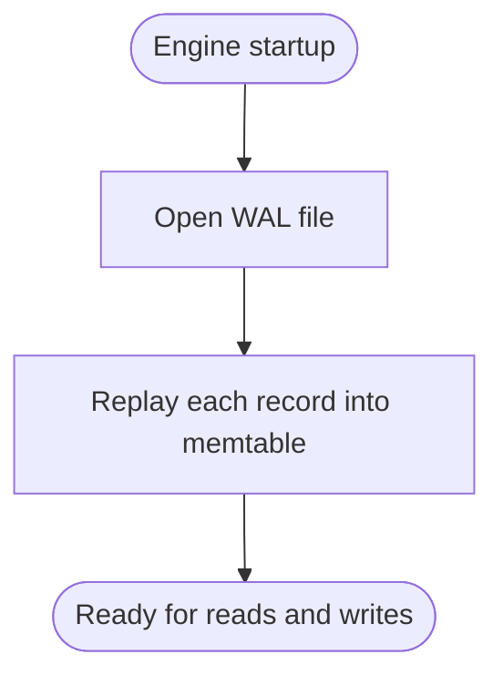

# LSM Tree Storage Engine

A from-scratch **LSM-tree key-value store** written in C++17. Keys and values are stored together in the LSM pipeline .

The engine implements a complete LSM pipeline: memtable, write-ahead log, SSTable flush, unified reads, compaction, and per-SSTable Bloom filters with sparse indexing. Benchmarks measure write throughput and read-path improvements from Bloom filters and sparse indexes.

---

## Features


| Component             | Description                                                    |
| --------------------- | -------------------------------------------------------------- |
| **Memtable**          | In-memory sorted store backed by a red-black tree              |
| **WAL**               | Append-only write-ahead log for crash recovery                 |
| **SSTable**           | Immutable on-disk sorted tables with footer metadata           |
| **Unified read path** | Memtable first, then SSTables newest → oldest                  |
| **Compaction**        | K-way merge of SSTables, newest-wins, tombstone GC             |
| **Bloom filter**      | Per-SSTable probabilistic membership test (skip files on miss) |
| **Sparse index**      | Per-SSTable sampled key → byte offset map for seek-before-scan |
| **Benchmarks**        | CSV + charts comparing optimized vs linear-scan reads          |


---

## Architecture

### System overview




### Write path




### Read path




### Compaction

When the number of SSTables exceeds `compact_threshold`, all SSTables are merged into one new file via k-way merge (newest entry wins on duplicate keys). Tombstones are dropped from the merged output. Old SSTable files are deleted.




### SSTable file layout




Each data entry (same layout in WAL and SSTable data section):


---

## Project structure




---

## Requirements

- **C++17** compiler (`g++` or `clang++`)
- **Python 3** + **matplotlib** (benchmark plotting only)

---

## Build and test

All commands run from the repository root.

### Memtable

```bash
g++ -std=c++17 -Wall -Wextra -I. memtable/memtable.cpp tests/memtable_test.cpp -o tests/memtable_test
./tests/memtable_test
```

### WAL + crash recovery

```bash
g++ -std=c++17 -Wall -Wextra -I. memtable/memtable.cpp wal/wal.cpp sstable/bloom_filter.cpp \
  sstable/sparse_index.cpp sstable/sstable.cpp engine/engine.cpp tests/wal_test.cpp -o tests/wal_test
./tests/wal_test
```

### SSTables + flush

```bash
g++ -std=c++17 -Wall -Wextra -I. memtable/memtable.cpp wal/wal.cpp sstable/bloom_filter.cpp \
  sstable/sparse_index.cpp sstable/sstable.cpp engine/engine.cpp tests/sstable_test.cpp -o tests/sstable_test
./tests/sstable_test
```

### Unified read path (Phase 4)

```bash
g++ -std=c++17 -Wall -Wextra -I. memtable/memtable.cpp wal/wal.cpp sstable/bloom_filter.cpp \
  sstable/sparse_index.cpp sstable/sstable.cpp engine/engine.cpp tests/engine_test.cpp -o tests/engine_test
./tests/engine_test
```

### Compaction (Phase 6)

```bash
g++ -std=c++17 -Wall -Wextra -I. memtable/memtable.cpp wal/wal.cpp sstable/bloom_filter.cpp \
  sstable/sparse_index.cpp sstable/sstable.cpp engine/engine.cpp tests/compaction_test.cpp -o tests/compaction_test
./tests/compaction_test
```

### Bloom filter + sparse index (Phase 5)

```bash
g++ -std=c++17 -Wall -Wextra -I. memtable/memtable.cpp wal/wal.cpp sstable/bloom_filter.cpp \
  sstable/sparse_index.cpp sstable/sstable.cpp engine/engine.cpp tests/index_test.cpp -o tests/index_test
./tests/index_test
```

---

## Benchmarks

Run the full benchmark suite (build, measure, plot):

```bash
bash benchmarks/run_benchmarks.sh
```

First-time plotting setup:

```bash
python3 -m venv benchmarks/.venv
benchmarks/.venv/bin/pip install matplotlib
```

### Output


| File                                          | Contents                            |
| --------------------------------------------- | ----------------------------------- |
| `benchmarks/output/phase7_baseline.csv`       | Raw metrics (local, not committed)  |
| `docs/benchmarks/phase7_read_comparison.png`  | Optimized vs linear scan (hit/miss) |
| `docs/benchmarks/phase7_sstable_sweep.png`    | Read latency vs SSTable count       |
| `docs/benchmarks/phase7_write_throughput.png` | Write throughput (puts/sec)         |


### Sample results

Configuration: 5000 keys, 64-byte values, flush threshold 100 (~50 SSTables).


| Benchmark | Optimized       | Linear scan  | Notes                              |
| --------- | --------------- | ------------ | ---------------------------------- |
| Read hit  | ~2077 µs/op     | ~7905 µs/op  | Sparse index reduces scan range    |
| Read miss | ~3724 µs/op     | ~17945 µs/op | Bloom filter skips ~49/50 SSTables |
| Write     | ~12676 puts/sec | —            | Full WAL + memtable + flush path   |


With 8 SSTables, optimized read hit latency (~714 µs) is roughly **3× faster** than linear scan (~2305 µs).

### Plots

**Optimized vs linear scan (read hit and read miss)**

Phase 7 read comparison: optimized vs linear scan

**Read latency vs SSTable count**

Read latency vs number of SSTables

**Write throughput**

Write throughput in puts per second

Regenerate plots (updates `docs/benchmarks/` for the README):

```bash
bash benchmarks/run_benchmarks.sh
```

---

## On-disk formats

### WAL record

Append-only. Replay rebuilds the memtable on startup.





### SSTable entry

Same byte layout as WAL records, plus footer metadata (sparse index, Bloom filter, magic).

---

## Design decisions

- **Red-black tree memtable** — O(log n) put/get with in-order iteration for sorted flush.
- **Tombstones** — Deletes are logical markers, not physical removal; required for correct reads across memtable + SSTables and for compaction.
- **WAL before memtable** — Durability: if the process crashes after WAL append, replay restores the write.
- **Per-SSTable Bloom filter** — Immutable, built at flush/compact time; enables fast negative lookups.
- **Sparse index (every Nth key)** — Binary search on sampled keys to seek before scanning; trade-off between index size and seek accuracy.
- **Newest-wins** — On read and compaction, the newest copy of a key (memtable > newer SSTable > older SSTable) takes precedence.

